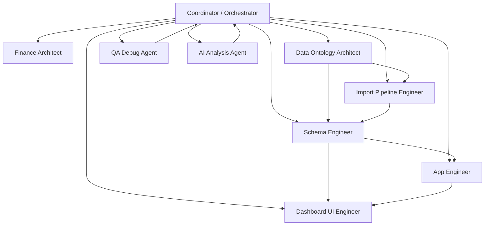

# Agent Topology

## Goal

This project should be operated as a coordinator system with specialist sub-agents. The point is not to have one general agent doing everything. The point is to route the right task to the right specialist and keep a single shared ontology underneath all of them.

This document describes the **development-time Codex operating model**. The app also has a separate **runtime product-agent graph** in `lsc-finance-dashboard/agents/agent-graph.ts` with agents such as `orchestrator`, `finance-agent`, `invoice-agent`, and `document-agent`. Do not mix the two layers:

- development specialists decide how to build safely
- runtime product agents answer user requests and execute approved skills
- `agent_activity_log` is the v1 runtime execution log
- `agent_tasks` and `agent_handoffs` are legacy/visualization tables unless explicitly upgraded later

## Topology

## Central Coordinator Responsibilities

- receives the task
- decides which specialist should act
- ensures specialists use the same ontology and metric dictionary
- sequences dependencies
- blocks work that skips canonical modeling
- approves final integration

## Specialist Responsibilities

### Finance Architect

- define KPI logic
- define revenue and cost treatment
- define break-even and commercial target formulas
- reject ambiguous finance definitions

### Data Ontology Architect

- define canonical entities and relationships
- define lineage from source rows to domain objects
- define what should be derived versus stored

### Schema Engineer

- implement Postgres schema in Neon
- create constraints, indexes, and views
- create migration-safe structures

### Import Pipeline Engineer

- design raw import tables
- map Google Sheets and folders into canonical records
- preserve source metadata and auditability

### App Engineer

- implement APIs and domain services
- ensure read models come from approved views or services

### Dashboard UI Engineer

- implement dashboard pages
- handle filters, drill-downs, and tables
- avoid embedding finance logic in components

### QA Debug Agent

- verify calculations
- test mappings and regressions
- isolate breakages quickly

### AI Analysis Agent

- summarize approved metrics
- explain changes, risks, anomalies
- never make up unsupported business insight

## Handoff Rules

1. Specialists must produce explicit outputs.
2. Handoffs should include assumptions and unresolved questions.
3. Schema changes must reference ontology changes.
4. UI changes must reference view or API sources.
5. AI analysis must reference approved derived metrics.

## Runtime Skill Registry Rules

1. Every non-infrastructure skill declared in `AGENT_SKILLS` must have a registered dispatcher handler.
2. Every mutating skill must require `approved=true` and an `idempotencyKey`.
3. Every mutating skill must write through a transaction-safe backend path where practical, record idempotency, and call the shared cascade/audit helper.
4. Notification send skills must be queued or sent only after explicit confirmation; draft skills remain read-only.
5. Dispatcher coverage tests must fail the release if a declared skill is missing a handler.
6. `/api/orchestrate` must never crash on missing provider keys; it must return a safe fallback result and record degraded runtime activity.
7. Production orchestration requires `ANTHROPIC_API_KEY`; document extraction requires `GEMINI_API_KEY`.

## Practical Codex Usage

Use the coordinator prompt to split work into specialist prompts, for example:

- ontology task first
- schema task second
- import task third
- UI task fourth
- QA task fifth

This gives you a stable tree of work instead of one large fragile prompt.
