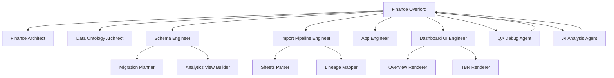

# Agent Graph Spec

## Purpose

The Agent Graph page should visualize how the internal agent system operates inside the finance app. This is not a decorative diagram. It should reflect real coordination structure, responsibilities, and handoffs.

## Core Concept

The main coordinating agent is:

- `Finance Overlord`

This is the central node. It routes work to specialist agents, receives outputs, and maintains consistency across the living dashboard.

The graph should resemble a neural-network or memory-graph style layout:

- one large central node
- multiple direct connection nodes around it
- optional secondary nodes connected to their parent specialist
- directed or typed edges showing interaction

## Primary Nodes

### Finance Overlord

Responsibilities:

- orchestration
- dependency ordering
- consistency checks
- task routing
- final synthesis

This should be visually the largest and most central node.

### Direct Specialist Nodes

These should connect directly to Finance Overlord:

- finance architect
- data ontology architect
- schema engineer
- import pipeline engineer
- app engineer
- dashboard UI engineer
- QA debug agent
- AI analysis agent

## Secondary Nodes

Optional secondary nodes can connect under a direct specialist when the app introduces deeper specialization.

Examples:

- under import pipeline engineer
  - sheets parser
  - file lineage mapper
  - normalization mapper

- under schema engineer
  - migration planner
  - analytics view builder
  - index optimizer

- under dashboard UI engineer
  - overview renderer
  - TBR renderer
  - commercial goals renderer

## Edge Types

Each connection should have a visible interaction type.

Recommended edge semantics:

- `routes_to`
- `reads_from`
- `writes_to`
- `validates`
- `reports_to`
- `depends_on`

Edge display can use:

- color
- line style
- arrow direction

## Data Model For This View

Suggested graph entities:

- `agent_nodes`
- `agent_edges`
- `agent_status_events`
- `agent_handoffs`
- `agent_tasks`

Suggested node fields:

- id
- name
- role
- type
- parent_agent_id
- status
- current_task
- last_active_at

Suggested edge fields:

- id
- from_agent_id
- to_agent_id
- interaction_type
- directionality
- active

## UI Sections

### 1. Network Graph

Shows:

- Finance Overlord at center
- specialist agents around center
- optional sub-agents branching outward

### 2. Agent Detail Panel

When a node is selected, show:

- role
- responsibilities
- current task
- last completed task
- direct dependencies
- recent messages or handoffs

### 3. Handoff Stream

A timeline or table showing:

- from agent
- to agent
- task summary
- timestamp
- status

### 4. Health Summary

Show:

- active agents
- blocked agents
- idle agents
- currently assigned tasks

## Example Graph

## Behavior Rules

1. The graph should reflect actual configured agents, not static decorative placeholders.
2. The Finance Overlord node should always remain visible.
3. Node and edge labels should be human-readable.
4. The page should support both static design mode and live status mode.

## V1 Implementation Approach

For v1, this page can run from a structured configuration file or database seed rather than a live multi-agent runtime. The model should still be designed so live agent events can replace static configuration later.
