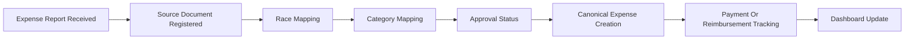

# Workflow Graph Spec

## Purpose

The Workflow Graph page should show how work moves through the finance system and dashboard stack. This is a process map, not an agent map.

The workflow graph should answer:

- what stages exist
- how data or work moves between them
- what stage is currently active
- what stages depend on each other
- where failures or bottlenecks are happening

## Visual Model

Use connected blocks with directional arrows.

This graph should look like:

- rectangular stage blocks
- lines or arrows connecting them
- optional branch paths
- clear left-to-right or top-to-bottom flow

Unlike the Agent Graph, this page is about system flow rather than networked agents.

## Core Workflow Stages

Recommended initial blocks:

1. Planning
2. Metric Definition
3. Ontology Design
4. Schema Design
5. Raw Import
6. Normalization
7. Canonical Record Creation
8. Derived Analytics Views
9. APIs And Services
10. Dashboard Rendering
11. QA Validation
12. AI Interpretation

## Secondary Workflow Branches

Additional branches can exist for specific flows:

### TBR Expense Flow

- expense report received
- source document registered
- race mapping
- category mapping
- approval status
- canonical expense creation
- payment or reimbursement tracking
- dashboard update

### Sponsorship Revenue Flow

- contract intake
- sponsor mapping
- invoice creation
- payment collection
- revenue recognition
- receivables update
- overview and TBR update
- commercial goals update

### Payments Flow

- payable invoice recorded
- due date assigned
- status tracked
- payment executed
- payment record linked
- dashboard updated

## Data Model For This View

Suggested entities:

- `workflow_nodes`
- `workflow_edges`
- `workflow_runs`
- `workflow_stage_events`
- `workflow_failures`

Suggested node fields:

- id
- name
- category
- sequence_order
- status
- owner_agent_id

Suggested edge fields:

- from_node_id
- to_node_id
- edge_type
- condition

## UI Sections

### 1. Main Workflow Canvas

Shows the core app lifecycle from planning to AI interpretation.

### 2. Flow Selector

Allows switching between:

- master system flow
- TBR expense flow
- sponsorship revenue flow
- payments flow

### 3. Stage Detail Panel

When a block is selected, show:

- description
- current status
- upstream dependencies
- downstream effects
- owning agent
- last execution timestamp

### 4. Failure And Bottleneck Summary

Show:

- blocked stages
- failed stages
- stale stages
- stages waiting on input

## Example Master Workflow

```mermaid
graph LR
    A["Planning"] --> B["Metric Definition"]
    B --> C["Ontology Design"]
    C --> D["Schema Design"]
    D --> E["Raw Import"]
    E --> F["Normalization"]
    F --> G["Canonical Record Creation"]
    G --> H["Derived Analytics Views"]
    H --> I["APIs And Services"]
    I --> J["Dashboard Rendering"]
    J --> K["QA Validation"]
    K --> L["AI Interpretation"]
```

## Example TBR Expense Workflow

## Behavior Rules

1. The graph should represent real workflow stages used by the system.
2. Status should be visible per stage.
3. The graph should allow future live instrumentation.
4. The page should work in both static configured mode and event-driven mode.

## V1 Implementation Approach

For v1, define the workflow graph from structured configuration and seeded stage data. Later, it can be connected to real workflow events, import jobs, agent tasks, and validation runs.
